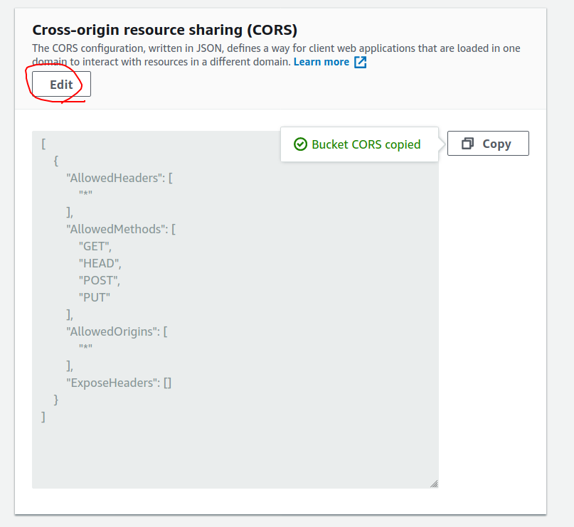
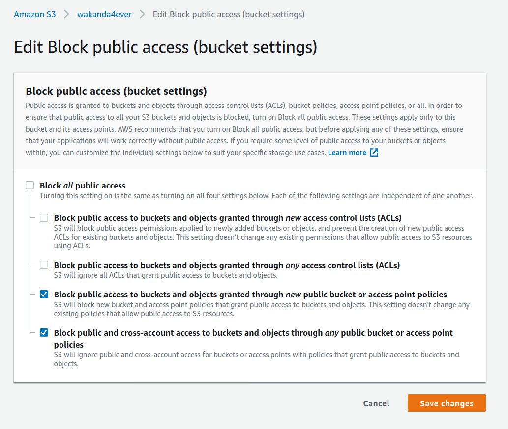

# DEMO: S3 presigned url upload

## Run Demo

Prepare the values for these env vars:

(See below for how to create a bucket)

```
AWS_ACCESS_KEY_ID=
AWS_SECRET_ACCESS_KEY=
AWS_REGION=
S3_BUCKET=your_s3_bucket_name
```

Then run `demo` script:

```
./demo
```

You will be prompted to edit .env (using vscode, you better have it)
Put in the values you prepared/fetched up front.
Now launch a browser and go to http://localhost:8000
Upload a file and go to https://s3.console.aws.amazon.com/s3/buckets/your_s3_bucket_name to see your uploaded files.

## Dev Resources

- https://docs.aws.amazon.com/AmazonS3/latest/API/sigv4-UsingHTTPPOST.html
- https://docs.aws.amazon.com/AmazonS3/latest/dev/PresignedUrlUploadObject.html
- https://docs.aws.amazon.com/AmazonS3/latest/API/sigv4-query-string-auth.html
- https://boto3.amazonaws.com/v1/documentation/api/latest/reference/services/s3.html#S3.Client.generate_presigned_url
- https://boto3.amazonaws.com/v1/documentation/api/latest/reference/services/s3.html#S3.Client.generate_presigned_post

## Example projecten

- Voorbeeld code voor pre-signed url: https://github.com/codingjoe/django-s3file/blob/9b751fb01640491c9d1fb81117dfd0b7f36188cf/s3file/forms.py#L56
- En een prachtig voorbeeld in een flask app's html: https://github.com/willwebberley/FlaskDirectUploader/blob/master/templates/account.html
- Capabel react component: https://www.npmjs.com/package/react-s3-uploader
  - werkt niet met de signed POST variant

## signed POST + fields vs generieke signed url met custom method via headers

Mooie uitleg voor \_post vs \_url methods: https://stackoverflow.com/questions/65198959/aws-s3-generate-presigned-url-vs-generate-presigned-post-for-uploading-files

## Bucket provisioning

Go to AWS S3 console and create a bucket. Now give it settings like state below.

### CORS policy

Use this as CORS policy for this demo. DO NOT USE IN PRODUCTION

```
[
    {
        "AllowedHeaders": [
            "*"
        ],
        "AllowedMethods": [
            "GET",
            "HEAD",
            "POST",
            "PUT"
        ],
        "AllowedOrigins": [
            "*"
        ],
        "ExposeHeaders": []
    }
]
```

Copy paste this in the cors editor under the Permission tab:


### Bucket Access settings

DO NOT USE IN PRODUCTION

Go to CORS-origin resource sharing under the Permission tab and make settings like this:


